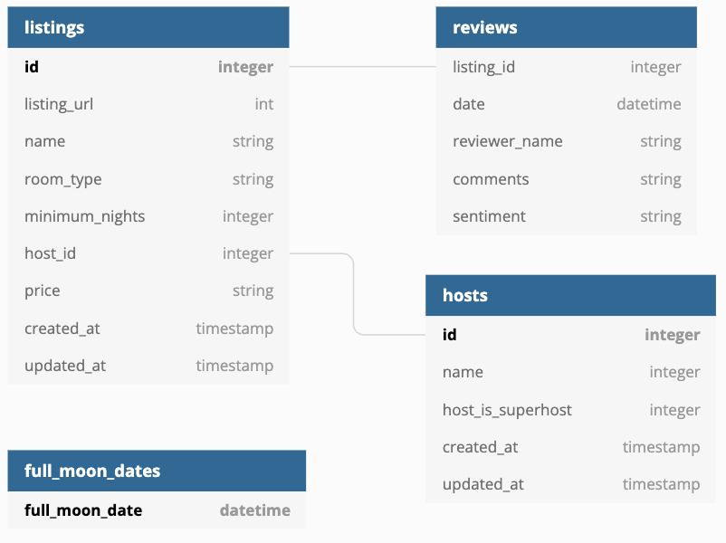

# Airbnb Analytics Engineering Project — dbt + Snowflake


## Overview

This repository is a hands-on **analytics engineering project** built with **dbt Core** and **Snowflake** on Airbnb-style data.

The project transforms raw warehouse tables into clean, tested, documented, analytics-ready models using layered SQL transformations, dbt tests, reusable packages, snapshots, Jinja, and automated CI validation.

```text
Snowflake RAW.AIRBNB
        │
        ▼
Source Models
   (ephemeral)
        │
        ▼
Dimensions + Facts
        │
        ▼
Analytics Mart
        │
        ▼
BI / Analysis
```

The repository focuses on the transformation layer rather than orchestration.

---

## Architecture



The dbt DAG is organized into four logical layers:

| Layer | Purpose | Examples |
|---|---|---|
| Source | Standardize access to raw Snowflake objects | `src_hosts`, `src_listings`, `src_reviews` |
| Dimension | Clean and enrich descriptive entities | `dim_hosts_cleansed`, `dim_listings_cleansed` |
| Fact | Model measurable business events | `fct_reviews` |
| Mart | Build analysis-ready business datasets | `full_moon_review` |

---

## Tech Stack

- **dbt Core**
- **Snowflake**
- **SQL**
- **Jinja**
- **YAML**
- **dbt Utils**
- **dbt Expectations**
- **GitHub Actions**
- **Git / GitHub**

---

## Repository Structure

```text
learn_dbt/
│
├── .github/
│   └── workflows/
│       └── dbt-ci.yml
│
├── assets/
│   └── input_schema.png
│
├── models/
│   ├── src/
│   │   ├── src_hosts.sql
│   │   ├── src_listings.sql
│   │   └── src_reviews.sql
│   │
│   ├── dim/
│   │   ├── dim_hosts_cleansed.sql
│   │   ├── dim_listings_cleansed.sql
│   │   └── dim_listings_W_hosts.sql
│   │
│   ├── fct/
│   │   └── fct_reviews.sql
│   │
│   ├── mart/
│   │   └── full_moon_review.sql
│   │
│   ├── sources.yml
│   ├── schema.yml
│   └── docs.md
│
├── snapshots/
│   └── SCD_raw_listing.sql
│
├── tests/
│   ├── consistent_created_at.sql
│   ├── dim_listings_min_nights.sql
│   └── no_null_in_dim_listings.sql
│
├── analyses/
├── macros/
├── seeds/
├── dbt_project.yml
├── packages.yml
└── README.md
```

---

## Transformation Layers

### 1. Source Layer

Raw Airbnb tables are declared in `models/sources.yml` and referenced through dbt's `source()` function.

The project currently models:

- `raw_listings`
- `raw_hosts`
- `raw_reviews`

The source models under `models/src` are configured as **ephemeral**, so dbt inlines their SQL into downstream models instead of creating unnecessary warehouse objects.

---

### 2. Dimension Layer

The dimension models clean and prepare reusable descriptive entities:

- `dim_hosts_cleansed.sql`
- `dim_listings_cleansed.sql`
- `dim_listings_W_hosts.sql`

Dimension models are configured as **tables** in `dbt_project.yml`.

This provides reusable, physically persisted models for downstream analytics.

---

### 3. Fact Layer

`fct_reviews.sql` models Airbnb review activity at fact-table grain.

It provides the event-level foundation for analyses such as:

- review activity over time;
- listing engagement;
- host/listing performance;
- behavioral and date-based analytics.

---

### 4. Mart Layer

`full_moon_review.sql` is an example of a business-facing mart.

```text
fct_reviews
     +
seed_full_moon_dates
     │
     ▼
full_moon_review
     │
     ▼
Review classification around full-moon dates
```

The model joins reviews with seeded full-moon dates and classifies each review as either:

- `full moon`
- `not full moon`

This demonstrates how reusable lower-level dbt models can feed a business-specific analytical dataset.

---

## Materialization Strategy

The project intentionally uses different materializations for different layers.

```text
Default models  → View
Source models   → Ephemeral
Dimension models → Table
Mart override   → Table
```

This demonstrates that dbt materialization choices should be based on model purpose, reusability, and performance rather than using one strategy everywhere.

---

## SCD Type 2 with dbt Snapshots

The repository includes a real dbt snapshot:

```text
snapshots/SCD_raw_listing.sql
```

It tracks historical changes to raw listing records using the **timestamp strategy**.

Key configuration:

```text
unique_key              = id
strategy                = timestamp
updated_at              = updated_at
invalidate_hard_deletes = true
```

This allows changes to a listing to be preserved historically instead of overwriting the previous state.

Run snapshots with:

```bash
dbt snapshot
```

This is the dbt implementation of a **Slowly Changing Dimension Type 2** pattern.

---

## Data Quality & Testing

Testing is a major part of this project rather than an afterthought.

### Generic tests

The project uses standard dbt tests such as:

- `unique`
- `not_null`
- `relationships`
- `accepted_values`

For example, listing records validate uniqueness and referential integrity between listings and hosts.

### Custom singular tests

The repository also contains custom SQL tests:

```text
tests/consistent_created_at.sql
tests/dim_listings_min_nights.sql
tests/no_null_in_dim_listings.sql
```

These validate business-specific rules that go beyond standard schema tests.

### dbt Expectations

The project uses `dbt_expectations` for more advanced validation, including:

- regex validation;
- expected distinct-value counts;
- table row-count comparison;
- percentile / quantile checks;
- maximum-value checks;
- data-type checks.

Some checks use warning severity when a rule should be monitored without failing the entire build.

Run all tests with:

```bash
dbt test
```

Or build models and test them together:

```bash
dbt build
```

---

## dbt Packages

Dependencies are defined in `packages.yml`.

Current packages:

```yaml
dbt-labs/dbt_utils
metaplane/dbt_expectations
```

Install them with:

```bash
dbt deps
```

Using packages keeps common macros and testing patterns reusable instead of rebuilding them manually.

---

## Documentation & Lineage

Model and column documentation is maintained through YAML and Markdown.

Generate the documentation site with:

```bash
dbt docs generate
dbt docs serve
```

dbt Docs provides:

- model descriptions;
- column metadata;
- source definitions;
- tests;
- model dependencies;
- an interactive lineage graph.

---

## Warehouse Permissions

The project includes a post-hook in `dbt_project.yml`:

```sql
grant select on {{ this }} to role reporter
```

After dbt creates a model, Snowflake read access can therefore be granted automatically to the `reporter` role.

This keeps part of the access-control workflow close to the data transformation code.

---

## CI with GitHub Actions

The repository includes a dbt CI workflow under:

```text
.github/workflows/dbt-ci.yml
```

On pushes and pull requests to `master`, the workflow:

1. checks out the repository;
2. installs Python;
3. installs `dbt-snowflake`;
4. installs dbt packages using `dbt deps`;
5. creates a temporary CI profile;
6. runs `dbt parse` to validate the project;
7. when Snowflake secrets are available, runs `dbt debug` and `dbt build`.

### GitHub Secrets for Snowflake CI

To enable live Snowflake builds, configure these repository secrets:

```text
DBT_SNOWFLAKE_ACCOUNT
DBT_SNOWFLAKE_USER
DBT_SNOWFLAKE_PASSWORD
DBT_SNOWFLAKE_ROLE
DBT_SNOWFLAKE_DATABASE
DBT_SNOWFLAKE_WAREHOUSE
DBT_SNOWFLAKE_SCHEMA
```

Credentials are not stored in the repository.

---

## How to Run Locally

### 1. Clone the project

```bash
git clone https://github.com/khaledsalah5/learn_dbt.git
cd learn_dbt
```

### 2. Create a virtual environment

```bash
python -m venv .venv
```

Activate it, then install dbt:

```bash
pip install dbt-snowflake
```

### 3. Configure the dbt profile

The project expects a profile named:

```text
dbtlearn
```

Configure your Snowflake credentials in your local `profiles.yml`.

Do not commit credentials to Git.

### 4. Install dbt packages

```bash
dbt deps
```

### 5. Validate the connection

```bash
dbt debug
```

### 6. Build the project

```bash
dbt build
```

### 7. Run snapshots

```bash
dbt snapshot
```

### 8. Generate documentation

```bash
dbt docs generate
dbt docs serve
```

---

## Data Engineering & Analytics Engineering Concepts Demonstrated

This project demonstrates practical experience with:

- ELT architecture;
- modular SQL transformations;
- source-to-mart modeling;
- dimensional modeling;
- dbt DAG dependencies;
- multiple materialization strategies;
- SCD Type 2 snapshots;
- Jinja templating;
- reusable packages;
- generic and custom data-quality tests;
- advanced `dbt_expectations` checks;
- documentation and lineage;
- warehouse permission hooks;
- Git-based development;
- CI validation with GitHub Actions.

---

## Production Enhancements

For a production environment, the next improvements would include:

- separate DEV / QA / PROD dbt targets;
- orchestration with Airflow or dbt Cloud;
- source freshness checks for time-sensitive raw tables;
- Slim CI / state-based model selection;
- environment-specific schemas;
- key-pair or workload-identity authentication instead of password-based CI;
- centralized monitoring and alerting;
- incremental materializations for larger fact datasets where appropriate;
- scheduled documentation and metadata publishing.

---

---

---

## Author

**Khaled Salah — Data Engineer**  
[LinkedIn](https://www.linkedin.com/in/khaled-salah5148/) · [Portfolio](https://khaledsalah5.github.io/Portfolio/) · [GitHub](https://github.com/khaledsalah5) · [Email](mailto:khaled.salah2803@gmail.com)
